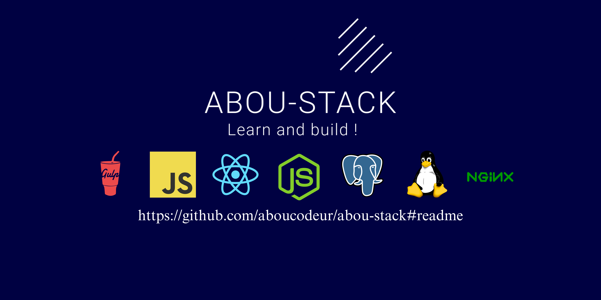
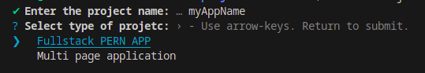

<h1 style="text-align:center; color:white; font-size:2.5em;">
  First Open Source Project in Mali!
</h1>

<div style="text-align:center;">
  
  <h3 style="text-align:center; color:#1565c0;">
    🚀 Not tired of JS? Learn by building your tech stack!
  </h3>
</div>

<h2>Story</h2>

<h3>
  My name is Aboubacar Barry, a young self-taught full-stack developer from Mali, now specializing in frontend development. React JS is what I use most in my daily work. It has allowed me to start and understand the JavaScript ecosystem and the web in general.

  My journey in programming wasn't easy, especially for a self-taught developer. Adding to the challenge, I come from Africa and a background where people primarily use computers for watching movies, YouTube, and office work.

  Despite all this, I overcame the challenge, creating local solutions that helped me earn some income for my daily expenses and equipment. I don't work for a company; I'm a free electron developing local solutions for now, learning development deeply, and coding open-source projects.
</h3>

This versatile code will allow me to launch a project quickly based on its type
without spending time reconfiguring everything or figuring out where to start.

Covers most cases in the development of an application like.

- **Frontend**
  - HTML / CSS                  => Classic web page
  - Framework                   => For modern applications
  - UI LIB / Animations LIB     => Enhance the user experience

- **Backend**
  - Script                      => Programming language used
  - Framework                   => Facilitate API and server development
  - Database                    => Make the application persistent
  - OS                          => Operating system on which the platform runs
  - CLOUD                       => Deployment and CI/CD

## Example of tech stack (Postgresql, Express JS, React JS, Node JS)

<div style="display:flex;justify-content:space-between;flex-wrap:wrap;">
  
  
  
  
</div>

<div>
  You can add your own packages = learn new thing like astro, next js..... !
</div>

## Tools Used

- **Node js**                         => Runtime
- **PNPM (workspaces setup)**         => packages/*
- **Packages**
  - **Frontend**  : React and Vite SPA
  - **Backend**   : Express js, Postgresql, sequelize ORM,
  - **Static**    : Astro MPA
- **CLI**
  - prompts
  - minimist
  - fs / path
  - package.json setup
- **BUILD**
  - Rollup
  - gulp for task runner and prepare package
  - gulp-shell run shell command
  - some rollup plugin to bundle it
- **DX (Developer Experience)**
  - eslint
  - prettier
  - vscode
  - vite
  - typescript
  - pnpm

## INSTALLATION

Installation is simple and fast. Just type and happy coding:

```bash
npm create abou-stack@latest myAppName
```

OR

<div>
  
</div>
